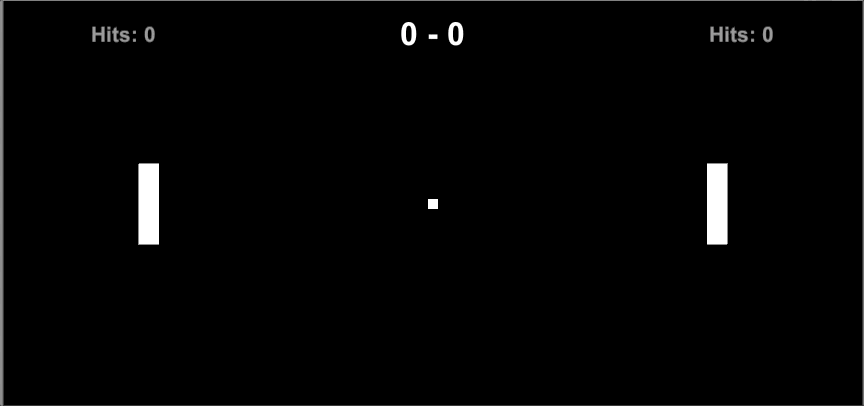

# Project Increment 4

The functionality from the previous increment increment and spawning a new ball into the game periodically; you’ll finally have multiple balls in the game.

| Description       | Points          |
| ------------- |:-------------:|
| New balls spawn every 5 to 10 seconds for multiple balls (not including spawns for lost or dead balls)   | 50.0 pts | 
| Balls aren’t spawned into collisions | 50.0 pts | 
| | Total Points: 100.0 |

