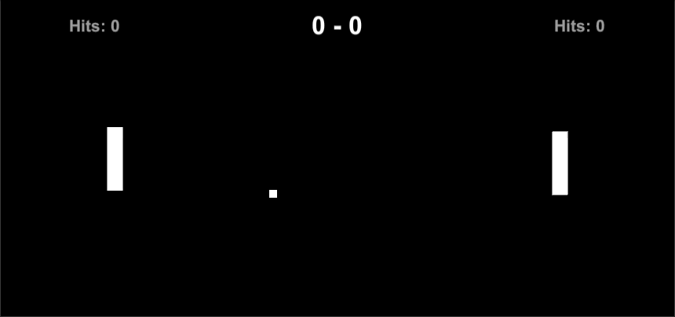

# Project Increment 6

The functionality from the previous increment and also includes bonus balls and the freezer pickup.

| Description       | Points          |
| ------------- |:-------------:|
| HUD AddPoints public static removed   | 5.0 pts | 
| Points added or ball lost event included in solution | 5.0 pts | 
| Event manager adds invokers and listeners for points added or ball lost event |  5.0 pts |
| Ball invokes points added or ball lost event properly |  5.0 pts |
| HUD listens for and handles points added or ball lost event properly | 5.0 pts |
| HUD AddHits public static removed | 5.0 pts |
| Hits added event included in solution | 5.0 pts |
| Event manager adds invokers and listeners for hits added event | 5.0 pts |
| Paddle invokes hits added event properly | 5.0 pts |
| HUD listens for and handles hits added event properly | 5.0 pts |
| Timer finished event included in solution | 5.0 pts |
| Timer invokes timer finished event properly | 5.0 pts |
| Timer users listen for and handle timer finished event properly | 5.0 pts |
| BallSpawner SpawnBall public removed | 5.0 pts |
| BallSpawner listens for and handles points added or ball lost event properly | 5.0 pts |
| Ball died event included in solution | 5.0 pts |
| Event manager adds invokers and listeners for ball died event | 5.0 pts |
| Ball invokes ball died event properly | 5.0 pts |
| BallSpawner listens for and handles ball died event properly | 5.0 pts |
| Freezer effect activation refactored to use delegates and event handlers | 5.0 pts |
| | Total Points: 100.0 |

