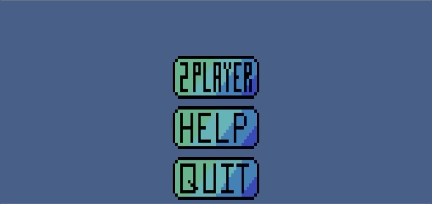

# Project Increment 8

The functionality from the previous increment and all the sound effects in your game. Your game also needs to implement the game over message when a player wins the game.

| Description       | Points          |
| ------------- |:-------------:|
| All buttons on all menus play sound (Note: the Quit button on the Main Menu doesn’t have to play a sound)  | 10.0 pts | 
| Quit button on game over message plays sound | 5.0 pts | 
| Sound effect when ball collides with ball |  5.0 pts |
| Sound effect when ball collides with paddle |  5.0 pts |
| Sound effect when ball is spawned | 5.0 pts |
| HSound effect when ball is lost | 5.0 pts |
| Sound effect when game is lost | 5.0 pts |
| Sound effect when freezer effect activated | 5.0 pts |
| Sound effect when freezer effect deactivated | 5.0 pts |
| Sound effect when speedup effect activated | 5.0 pts |
| Sound effect when speedup effect deactivated | 5.0 pts |
| Game over message displayed and game paused when a player wins | 15.0 pts |
| Game over message displays correct winner | 15.0 pts |
| Game over message back button unpauses game and returns to main menu when clicked | 10.0 pts |
| | Total Points: 100.0 |

### Main Menu & Help Menu

### 2 player game
#### Pause functionality w/ resume and quit and Quit functionality from the main menu

### 2 player game (cont.)
#### Right Player Wins

### 2 player game (cont.)
#### Left Player Wins

